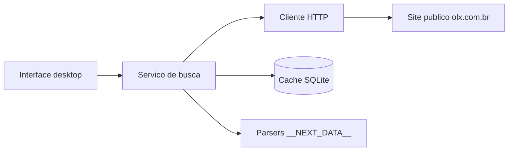

# OLX Imóveis Desktop

[](https://www.python.org/downloads/)
[](LICENSE)
[](https://www.microsoft.com/windows)
[](https://github.com/jwmenezes/api-olx-imoveis/actions/workflows/ci.yml)

Aplicativo desktop para **Windows** que facilita a **busca de imóveis** publicados na [OLX Brasil](https://www.olx.com.br), com filtros por localidade, tipo, preço e visualização de detalhes do anúncio e do anunciante.

> **Este projeto não é afiliado, endossado ou mantido pela OLX.** OLX é marca de seus respectivos titulares.

---

## Sobre o projeto

O **OLX Imóveis Desktop** é uma ferramenta de uso pessoal para quem quer pesquisar apartamentos, casas e outros imóveis na OLX sem depender apenas do navegador. O foco é reunir filtros úteis em uma interface simples e permitir gerar um executável (`.exe`) para usuários que não programam.

O sistema consulta **páginas públicas** do site da OLX e organiza os resultados localmente. Não substitui o site oficial para negociação — use-o como apoio à sua pesquisa imobiliária.

## Objetivos

- **Agilizar a busca** com filtros de estado, região, bairro, tipo de imóvel, venda/aluguel, faixa de preço e quartos.
- **Centralizar informações** do anúncio: descrição, características, fotos (via link), dados do anunciante e telefone quando disponível nos dados públicos.
- **Oferecer um executável** para Windows, dispensando instalação de Python no dia a dia.
- **Respeitar limites de uso**: intervalo entre requisições, cache local e avisos legais na primeira execução.

## O que o sistema faz

| Área | Funcionalidade |
|------|----------------|
| **Busca** | Filtros por UF, região/cidade, bairro (via catálogo em `data/`), tipo (apartamento, casa, terreno…), venda ou aluguel, preço mín/máx, quartos mínimos e termo livre |
| **Resultados** | Listagem com título, preço e localização; paginação com **Carregar mais** |
| **Detalhe** | Descrição completa, atributos (quartos, área, condomínio etc.), anunciante (nome, perfil profissional), telefone com **Copiar** quando disponível |
| **Exportação** | Resultados da busca em CSV (`%LOCALAPPDATA%\OlxImoveis\resultados_olx.csv`) |
| **Acesso responsável** | Throttle HTTP, cache SQLite de listagens, User-Agent identificável |
| **Interface** | GUI em [CustomTkinter](https://github.com/TomSchimansky/CustomTkinter); disclaimer LGPD/Termos na primeira execução |

## O que o sistema **não** faz

- **Não utiliza** a [API oficial de integração da OLX](https://developers.olx.com.br/anuncio/home.html) — essa API é voltada a **anunciantes** que publicam o próprio inventário, não a busca pública no marketplace.
- **Não é** produto oficial, parceiro ou serviço autorizado da OLX.
- **Não garante** telefone do anunciante em todos os anúncios (muitos exibem o contato só no site).
- **Não deve** ser usado para montar bases de dados de terceiros ou spam — veja [Aviso legal](#aviso-legal-e-lgpd).

## Como funciona (resumo técnico)

1. Monta URLs de busca compatíveis com o site (`*.olx.com.br/imoveis/...`).
2. Baixa o HTML da listagem e extrai o JSON embutido em `__NEXT_DATA__` (Next.js).
3. Para cada anúncio selecionado, carrega a página de detalhe e extrai descrição, atributos e dados do vendedor.

Detalhes de parâmetros e estrutura JSON: [`docs/olx_reverse_engineering.md`](docs/olx_reverse_engineering.md).



## Capturas de tela

_Screenshots serão adicionados nas [Releases](https://github.com/jwmenezes/api-olx-imoveis/releases) após validação da interface. Execute o app localmente com `run_app.bat` para visualizar._

## Instalação rápida

### Usuário final (executável)

1. Acesse [Releases](https://github.com/jwmenezes/api-olx-imoveis/releases) e baixe `OlxImoveis.exe` (quando disponível).
2. Execute o arquivo no Windows 10 ou superior.
3. Aceite o aviso legal na primeira abertura e use os filtros na barra lateral.

### Gerar o `.exe` você mesmo

Requisitos: Python 3.10+ no Windows.

```powershell
git clone https://github.com/jwmenezes/api-olx-imoveis.git
cd api-olx-imoveis
python -m venv .venv
.\.venv\Scripts\Activate.ps1
pip install -r requirements.txt
.\build_exe.bat
```

O executável será gerado em `dist\OlxImoveis.exe`.

## Desenvolvimento

```powershell
git clone https://github.com/jwmenezes/api-olx-imoveis.git
cd api-olx-imoveis
python -m venv .venv
.\.venv\Scripts\Activate.ps1
pip install -r requirements.txt
pip install -e .

# Executar interface
$env:PYTHONPATH = "src"
python -m gui.app
# ou: olx-imoveis

# Testes
$env:PYTHONPATH = "src"
pytest tests/ -v
```

Atalho: `run_app.bat`

### Personalizar regiões e bairros

Edite ou crie `data/regions_{uf}.json`. Exemplo para São Paulo: [`data/regions_sp.json`](data/regions_sp.json). Os slugs devem coincidir com os da URL do site OLX.

## Estrutura do repositório

```
api-olx-imoveis/
├── src/
│   ├── olx_imoveis/     # HTTP, parsers, cache, serviço
│   └── gui/             # Interface CustomTkinter
├── data/                # Regiões e bairros por UF
├── docs/                # Documentação técnica
├── tests/               # Testes com fixtures HTML
├── build/               # Configuração PyInstaller
├── LICENSE
├── README.md
└── CONTRIBUTING.md
```

## Aviso legal e LGPD

- Use o aplicativo apenas para **fins pessoais** de busca de imóveis.
- Respeite os [Termos de Uso da OLX](https://ajuda.olx.com.br/).
- Dados de contato (telefone) são **dados pessoais** sob a [LGPD](https://www.gov.br/anpd/pt-br) — não compartilhe, revenda ou automatize contato em massa.
- O layout do site pode mudar; nesse caso pode ser necessário atualizar o aplicativo.
- Os autores **não se responsabilizam** pelo uso que terceiros fizerem da ferramenta em desacordo com a lei ou com os termos da OLX.

## Publicar / clonar

- **Publicar no seu GitHub:** siga [`docs/GITHUB_PUBLISH.md`](docs/GITHUB_PUBLISH.md) ou execute `.\scripts\publish-github.ps1` após `gh auth login`.
- **Clonar:** `git clone https://github.com/jwmenezes/api-olx-imoveis.git` (ajuste o usuário se o repositório estiver em outra conta).

## Contribuições

Contribuições são bem-vindas via Issues e Pull Requests. Leia [`CONTRIBUTING.md`](CONTRIBUTING.md) antes de enviar alterações.

## Licença

Código-fonte sob licença [MIT](LICENSE). A marca **OLX** pertence aos seus respectivos titulares.

## Referências

- Portal de integração OLX (publicação de anúncios): [developers.olx.com.br](https://developers.olx.com.br/)
- Suporte a integradores oficiais: [suporteintegrador@olxbr.com](mailto:suporteintegrador@olxbr.com)
